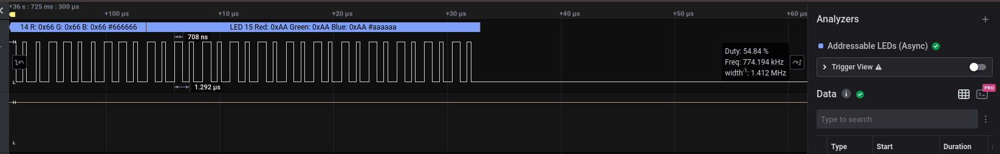
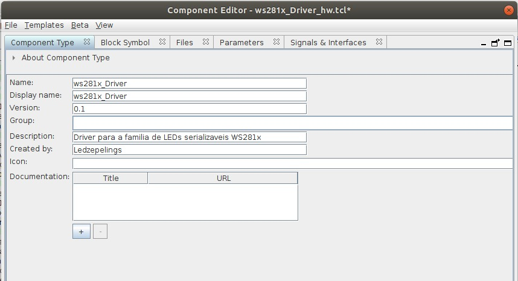

# Coloque aqui o nome do tutorial de vocês

- **Alunos:** Manoela Cirne Liam de Campos / Wesley Gabriel Albano da Silva
- **Curso:** Engenharia da Computação
- **Semestre:** 9
- **Contato:** corsiferrao@gmail.com
- **Ano:** 2020

## Começando

Para seguir esse tutorial é necessário:

- **Hardware:** DE10-Standard e matriz de leds WS2812 AdaFruit
- **Softwares:** Quartus 18.01
- **Documentos:** [DE10-Standard_User_manual.pdf](https://github.com/Insper/DE10-Standard-v.1.3.0-SystemCD/tree/master/Manual)
[Funcionamento dos leds](https://cpldcpu.wordpress.com/2014/01/14/light_ws2812-library-v2-0-part-i-understanding-the-ws2812/#:~:text=The%20cycle%20time%20of%20a,ns%20(maximum%20on%20WS2812))

## Motivação

não sei

----------------------------------------------

!!! info 
    Essas duas partes são obrigatórias no tutorial:
    
    - Nome
    - Começando
    - Motivação

## Como funciona a matriz de leds

A fita que foi utilizada tem 276 leds e em cada led existem 3 pixeis (RGB na orgem GBR). A intensidade com que cada pixel será acionado ditará a cor de cada led.

Cada led usa 24 bits, 8 para verde, 8 para o azul e 8 para o vermelho. A fita coleta os dados utilizando os primeiros 24 bits para o led 0 os próximos 24 para o led 1 e assim por diante. 
Cada sinal tem 1292 nano segundos. O bit 1 corresponde a um sinal com 958 nano segundos em high e 252 nano segundos em low e o bit 0 corresponde a um sinal com 333 nano segundo em high e 937 nano segundos em low.



###### Figura 1 - Tempo de high e low para a escrita do bit 1

Para reiniciar a escrita no led0 deve existir um espaço de tempo entre os dados igual ou maior que 70 micro segundos.


###### figura 2 - Espaço de tempo entre dados para voltar para o led 0

Para converter isso para a FPGA, que tem clock de 50Mhz a informação enviada deve permanecer a mesma por alguns clocks. Para executar um bit com valor 1 é necessário descartar 40 clock depois de acionado o high e 20 clocks depois do low e para o bit 0 é preciso descartar 17 clocks depois do high e 43 depois do low. Para voltar a escrever no led0 20000 clocks são descartados.

Na tabela abaixo:

* T0H é tempo em high para bit 0
* T0L é tempo em low para bit 0
* T1H é tempo em high para bit 1
* T1L é tempo em low para bit 1
* RES é tempo em low para voltar ao led0

|             |  Tempo (ns) |  Clock (u)  |
| ----------- | ----------- | ----------- |
| T0H         | 333         | 17          |
| T0L         | 937         | 43          |
| T1H         | 958         | 40          |
| T1L         | 252         | 20          |
| RES         | 70000       | 20000       |


----------------------------------------------

## Conectando a matriz de leds na FPGA

Para conectar a matriz de led na FPGA o pino de data deve ser configurado no pin planer. Lembrando que a FPGA já tem um pino 5V e o ground.

!!! note 
    - Lembre-se que o ground da placa e da matriz devem estar conectados para que os pulsos sejam detectados corretamente.


###### figura 4 - Conectores da matriz de led

----------------------------------------------

## Códigos em VHDL
### Lembrara de colocar como a vram é criada no quartus

Serão necessário 3 códigos em vhdl:

* Máquina de estados: Define e aplica os tempos de delay dependendo das informações contidas na memória.
* Driver: Conecta a memória e a máquina de estados.
* GlueLogic: Logica de conexão do perifério no barramento Avalon.

=== "Código da máquina de estados"
    ``` VHDL
    library ieee;
    use ieee.std_logic_1164.all;
    use ieee.numeric_std.all;

    entity WS2812 is
        generic (
            pixel_count 	 : integer := 768;
            clock_frequency : integer := 50_000_000 -- Hertz
        );
        port (
            clk  : in std_logic;
            rst  : in std_logic;
            data : in std_logic_vector(23 downto 0); -- for testbench validation only
            addr : out std_logic_vector(9 downto 0);
            serial : out std_logic
        );
    end entity WS2812;

    architecture arch of WS2812 is

        constant T0H : integer := 17;
        constant T0L : integer := 43; -- compensate for state changes
        constant T1H : integer := 40;
        constant T1L : integer := 20; -- compensate for state changes
        constant RES : integer := 20000;
        
        --type LED_ring is array (0 to (pixel_count - 1)) of std_logic_vector(23 downto 0);
        type state_machine is (load, sending, send_bit, reset);

    begin
        process
            variable state : state_machine := reset;
            variable GRB : std_logic_vector(23 downto 0) := x"000000";
            variable delay_high_counter : integer := 0;
            variable delay_low_counter : integer := 0;
            variable index : integer := 0;
            variable bit_counter : integer := 0;

        begin
            wait until rising_edge(clk);
            case state is						
                when load => -- Update GRB with data coming from RAM
                            GRB := data;
                            bit_counter := 24;
                            state := sending;
                when sending =>
                        if (bit_counter > 0) then
                            bit_counter := bit_counter - 1;
                            if GRB(bit_counter) = '1' then
                                delay_high_counter := T1H;
                                delay_low_counter := T1L;
                            else
                                delay_high_counter := T0H;
                                delay_low_counter := T0L;
                            end if;
                            state := send_bit;
                        else
                            if (index < (pixel_count - 1)) then
                                index := index + 1;
                                addr <= std_logic_vector(to_unsigned(index, addr'length));
                                state := load;
                            else
                                delay_low_counter := RES;
                                state := reset;
                            end if;
                        end if;
                when send_bit =>
                        if (delay_high_counter > 0) then
                            serial <= '1';
                            delay_high_counter := delay_high_counter - 1;
                        elsif (delay_low_counter > 0) then
                                serial <= '0';
                                delay_low_counter := delay_low_counter - 1;
                        else
                            state := sending;
                        end if;
                when reset =>
                        if (delay_low_counter > 0) then
                            serial <= '0';
                            delay_low_counter := delay_low_counter - 1;
                        else
                            index := 0;
                            addr <= std_logic_vector(to_unsigned(index, addr'length));
                            state := load;
                        end if;
                when others => null;
            end case;
        end process;
    end arch;
    ```
=== "Código do Driver"
    ``` VHDL
    library IEEE;
    use IEEE.std_logic_1164.all;

    entity WS2812Driver is
        port (
            -- Gloabals
            clock   : in  std_logic;  
            reset	 : in std_logic;

            -- I/Os
            led_serial_out : out std_logic;
        -- led_pio  : out std_logic_vector(9 downto 0);
            wraddress		 : in std_logic_vector(9 downto 0);
            input_data	 : in std_logic_vector(23 downto 0);
            wren			 :	in std_logic
            
    );
    end entity WS2812Driver;

    architecture rtl of WS2812Driver is

    signal debug_led : std_logic_vector(23 downto 0) := (others => '0');
    signal driver_data : std_logic_vector(23 downto 0) := (others => 'X');
    signal raddress : std_logic_vector(9 downto 0);

    component WS2812 is
        generic (
            pixel_count 	 : integer := 768;
            clock_frequency : integer := 50_000_000 -- Hertz
        );
        port (
            clk : in std_logic := 'X';
            rst : in std_logic := '0';
            data : in std_logic_vector(23 downto 0) := (others => 'X');
            addr : out std_logic_vector(9 downto 0);
            serial : out std_logic := '1'
        );
    end component WS2812;

    component vram
        PORT
        (
            clock		: IN STD_LOGIC  := '1';
            data		: IN STD_LOGIC_VECTOR (23 DOWNTO 0);
            rdaddress		: IN STD_LOGIC_VECTOR (9 DOWNTO 0);
            wraddress		: IN STD_LOGIC_VECTOR (9 DOWNTO 0);
            wren		: IN STD_LOGIC  := '0';
            q		: OUT STD_LOGIC_VECTOR (23 DOWNTO 0)
        );
    end component;


    begin

        -- led_pio <= raddress(9 downto 0);
        
        d0 : component vram
            port map (
                clock => clock,
                data => input_data,
                rdaddress => raddress,
                wraddress => wraddress,
                wren => wren,
                q => driver_data
            );
        
        d1 : component WS2812 
            generic map (
                pixel_count => 10,
                clock_frequency => 50_000_000
            )
            port map (
                clk => clock,
                rst => reset,
                data => driver_data,
                addr => raddress,
                serial => led_serial_out
            );

    end rtl;
    ```
=== "GlueLogic"
    ```VHDL
    library IEEE;
    use IEEE.std_logic_1164.all;

    entity ws281x_MM is
        port (
            -- Globals
            clk                : in  std_logic                     := '0';             
            reset              : in  std_logic                     := '0'; 
                
            serial_out : out std_logic;
    
            -- Avalon Memmory Mapped Slave
            avs_address     : in  std_logic_vector(9 downto 0)  := (others => '0'); 
            avs_read        : in  std_logic                     := '0';             
            avs_readdata    : out std_logic_vector(31 downto 0) := (others => '0'); 
            avs_write       : in  std_logic                     := '0';           
            avs_writedata   : in  std_logic_vector(31 downto 0) := (others => '0')  
        );
    end entity ws281x_MM;

    architecture rtl of ws281x_MM is

    component WS2812Driver is
        port (
            -- Gloabals
            clock   : in  std_logic;
            reset	 : in std_logic;

            -- I/Os
            led_serial_out : out std_logic;
        -- led_pio  : out std_logic_vector(9 downto 0);
            wraddress		 : in std_logic_vector(9 downto 0);
            input_data	 : in std_logic_vector(23 downto 0);
            wren			 :	in std_logic
            
    );
    end component WS2812Driver;

    begin
        dd : component WS2812Driver
            port map (
                clock => clk,
                reset => reset,
                led_serial_out => serial_out,
                wraddress => avs_address,
                input_data => avs_writedata(23 downto 0),
                wren => avs_write
            );
    end rtl;
    ```


----------------------------------------------

## Criação do pereférico no plataform designer

Abra o Plataform designer e adicione os seguintes componentes:

* On-Chip Memory (RAM or ROM Intel FPGA IP)
    * Type: RAM
    * Total Memory size: 65536 bytes
* On-Chip Memory (RAM or ROM Intel FPGA IP)
    * Type: RAM
    * Total Memory size: 65536 bytes
* Jtag UART Intel FPGA IP
    * Default
* NIOS II Processor
    * Type: NIOS II/e

Depois crie o seguinte componente como mostrado nas figuras a seguir:



###### plataform designer - parte1


###### plataform designer - parte2


###### plataform designer - parte3

Por fim faça as conexões como estão abaixo:


###### plataform designer - parte4


----------------------------------------------

## Resultados

O rtl gerado deve ser como este.


###### RTL

O componente WS2812 deve ler os endereços da memória, processar a informação como descrito nos códigos em vhdl e passar os dados para a matriz de led pelo serial. A NIOS deve ser capaz de modificar a ram com o wren (permitindo escrita), data (o dado a ser scrito) e address (o endereço que deve ser moficado).

----------------------------------------------


## Recursos Markdown

Vocês podem usar tudo que já sabem de markdown mais alguns recursos:

!!! note 
    Bloco de destaque de texto, pode ser:
    
    - note, example, warning, info, tip, danger
    
!!! example "Faça assim"
    É possível editar o título desses blocos
    
    !!! warning
        Isso também é possível de ser feito, mas
        use com parcimonia.
    
??? info 
    Também da para esconder o texto, usar para coisas
    muito grandes, ou exemplos de códigos.
    
    ```txt
    ...
    
    
    
    
    
    
    
    
    
    
    
    oi!
    ```
    
- **Esse é um texto em destaque**
- ==Pode fazer isso também==

Usar emojis da lista:

:two_hearts: - https://github.com/caiyongji/emoji-list


```c
// da para colocar códigos
 void main (void) {}
```

É legal usar abas para coisas desse tipo:
    
=== "C"

    ``` c
    #include <stdio.h>

    int main(void) {
      printf("Hello world!\n");
      return 0;
    }
    ```

=== "C++"

    ``` c++
    #include <iostream>

    int main(void) {
      std::cout << "Hello world!" << std::endl;
      return 0;
    }
    ```

Inserir vídeo:

-  Abra o youtube :arrow_right: clique com botão direito no vídeo :arrow_right: copia código de incorporação:

<iframe width="630" height="450" src="https://www.youtube.com/embed/UIGsSLCoIhM" frameborder="0" allow="accelerometer; autoplay; clipboard-write; encrypted-media; gyroscope; picture-in-picture" allowfullscreen></iframe>

!!! tip
    Eu ajusto o tamanho do vídeo `width`/`height` para não ficar gigante na página
    
Imagens você insere como em plain markdown, mas tem a vantagem de poder mudar as dimensões com o marcador `{width=...}`
    


{width=200}
